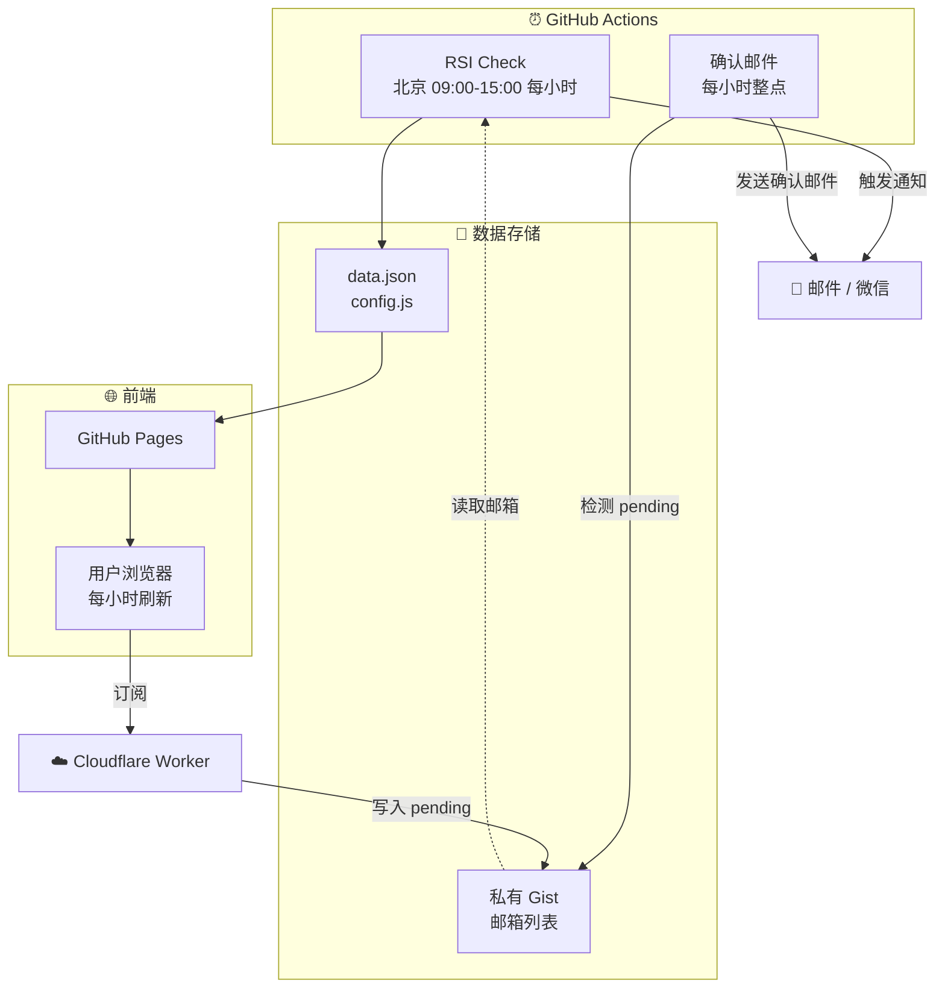

# 📈 JTrading - 红利低波ETF (512890) 智能监控系统

[](https://github.com/Pear56/JTrading/actions/workflows/rsi_check.yml)
[](https://github.com/Pear56/JTrading/actions/workflows/send_confirmation.yml)
[](https://pear56.github.io/JTrading/)
[](https://opensource.org/licenses/MIT)

**JTrading** 是一个基于 GitHub Actions 的 Serverless 自动化交易辅助系统。专为 **红利低波ETF (512890)** 设计，全自动监控 RSI 技术指标，提供现代化可视化看板，并在出现买卖信号时通过多渠道发送提醒。

---

## ✨ 核心功能

### 1. 📊 现代化可视化看板
- **环形进度仪表盘**: RSI 数值一目了然
- **动态状态反馈**: 根据 RSI 状态自动变色（超卖绿/超买红/中性灰）
- **响应式布局**: 完美适配桌面与移动端
- **深色模式**: 支持系统级 Dark Mode
- **自动刷新**: 每小时自动更新数据

### 2. 🤖 全自动智能监控
- **交易时段运行**: 北京时间 09:00-15:00 每小时执行
- **数据持久化**: 自动生成 `data.json` 驱动前端更新

### 3. 🔔 多渠道即时通知
- **邮件推送**: HTML 格式邮件，内置取消订阅链接
- **微信提醒**: 集成 Server酱

### 4. 📧 自动订阅管理
- **一键订阅**: 网页填写邮箱，自动添加到订阅列表
- **Cloudflare Worker**: 边缘计算处理订阅请求
- **确认邮件**: 新订阅者在 1 小时内收到 HTML 确认邮件
- **双重保险**: Worker + Formspree 双重备份

---

## 🏗️ 系统架构

### 核心组件

| 组件 | 说明 |
|------|------|
| **GitHub Actions** | 定时任务调度引擎 |
| **GitHub Pages** | 静态前端托管 |
| **Cloudflare Worker** | 边缘计算处理订阅 |
| **私有 Gist** | 订阅者邮箱存储 |

### 数据流



### 流程说明

| 流程 | 触发时间 | 说明 |
|------|----------|------|
| **RSI 监控** | 北京 09:00-15:00 每小时 | 抓取数据 → 生成 data.json → 触发通知 |
| **订阅处理** | 用户点击订阅 | Worker → 写入 `[pending]` 到 Gist |
| **确认邮件** | 每小时整点 | 检测 pending → 发邮件 → 移除标记 |
| **前端刷新** | 每小时自动 | 拉取最新 data.json |

---

## 📂 项目结构

```text
trading_rsi_app/
├── .github/workflows/
│   ├── rsi_check.yml           # RSI 监控 (北京时间 09:00-15:00 每小时)
│   └── send_confirmation.yml   # 确认邮件 (每小时整点)
├── cloudflare-worker/
│   ├── worker.js               # 订阅服务
│   └── wrangler.toml           # Worker 配置
├── docs/
│   ├── index.html              # 前端看板
│   ├── config.js               # (自动生成) 订阅服务配置
│   └── data.json               # (自动生成) RSI 数据
├── github_action_runner.py     # RSI 监控核心脚本
├── send_confirmation.py        # 确认邮件发送脚本
└── requirements.txt            # Python 依赖
```

---

## 🚀 快速部署

### 1. Fork 项目
点击右上角 **Fork** 按钮。

### 2. 配置 GitHub Secrets
进入 **Settings** → **Secrets and variables** → **Actions** → **Secrets**：

| Secret 名称 | 必填 | 说明 |
| :--- | :--- | :--- |
| `SENDER_EMAIL` | ✅ | 发件邮箱 (如 `xxx@126.com`) |
| `SENDER_PASSWORD` | ✅ | SMTP 授权码 |
| `SUBSCRIBER_EMAILS` | ⚠️ | 接收通知邮箱 (逗号分隔，未配置 Gist 时使用) |
| `GIST_SUBSCRIBERS_URL` | ❌ | 私有 Gist 的 Raw URL |
| `GIST_TOKEN` | ❌ | Gist 只读 Token |
| `GIST_TOKEN_WRITE` | ❌ | Gist 读写 Token |
| `GIST_ID` | ❌ | Gist ID |
| `GIST_FILENAME` | ❌ | Gist 文件名 |
| `SUBSCRIBE_WORKER_URL` | ❌ | Cloudflare Worker URL |
| `FORMSPREE_ID` | ❌ | Formspree 表单 ID (备用) |
| `SERVERCHAN_KEY` | ❌ | Server酱 Key (微信通知) |

> 默认使用 `smtp.126.com`，其他邮箱需额外配置 `SMTP_SERVER` 和 `SMTP_PORT`。

### 3. 启用 GitHub Pages
1. 进入 **Actions**，手动运行一次 **"Daily RSI Check"**
2. 进入 **Settings** → **Pages**
3. Source 选择 `main` 分支，文件夹 `/docs`
4. 访问 `https://<用户名>.github.io/JTrading/`

---

## 📧 配置自动订阅功能

### 订阅流程

```
用户订阅 → Worker 写入 [pending] email → Gist
                                          ↓
                              Actions 每小时检测
                                          ↓
                              发送确认邮件 + 移除 [pending]
```

### 步骤 1: 创建私有 Gist
1. 访问 [gist.github.com](https://gist.github.com/)
2. 创建 **Secret gist**，文件名 `subscribers.txt`
3. 记录 Gist ID 和 Raw URL

### 步骤 2: 创建 GitHub Token
创建两个 Token：
- **只读 Token** → `GIST_TOKEN`
- **读写 Token** → `GIST_TOKEN_WRITE` + Worker 的 `GITHUB_TOKEN`

### 步骤 3: 部署 Cloudflare Worker
1. 创建 Worker，粘贴 `worker.js` 代码
2. 配置环境变量：

| 变量名 | 值 |
|--------|---|
| `GIST_ID` | Gist ID |
| `GIST_FILENAME` | `subscribers.txt` |
| `GITHUB_TOKEN` | 读写 Token (Secret) |
| `ALLOWED_ORIGIN` | `https://<用户名>.github.io` |

### 步骤 4: 添加 GitHub Secrets
| Secret 名称 | 值 |
|------------|---|
| `SUBSCRIBE_WORKER_URL` | Worker URL |
| `GIST_ID` | Gist ID |
| `GIST_FILENAME` | `subscribers.txt` |
| `GIST_TOKEN_WRITE` | 读写 Token |

### 步骤 5: 触发 Actions
运行一次 **"Daily RSI Check"** 生成 `config.js`。

---

## 🔄 调度时间说明

| Workflow | Cron | 说明 |
|----------|------|------|
| RSI Check | `0 1-7 * * *` | UTC 01:00-07:00 = 北京 09:00-15:00 每小时 |
| Send Confirmation | `0 * * * *` | 每小时整点 (24小时) |
| 前端自动刷新 | - | 每小时刷新 data.json |

> ⚠️ GitHub Actions 调度有延迟，实际执行时间可能晚 5-15 分钟。

---

## 💻 本地开发

```powershell
# 安装依赖
pip install -r requirements.txt

# 设置环境变量
$env:SENDER_EMAIL="your@126.com"
$env:SENDER_PASSWORD="smtp_password"
$env:SUBSCRIBER_EMAILS="test@example.com"

# 运行
python github_action_runner.py
```

本地测试订阅功能需手动创建 `docs/config.js`：
```javascript
const CONFIG = {
  WORKER_URL: 'https://your-worker.workers.dev/',
  FORMSPREE_ID: 'your_id'
};
```

---

## ⚠️ 免责声明

本项目仅供学习交流，数据来源于网络，不保证准确性。**不构成任何投资建议**，市场有风险，投资需谨慎。

## 📄 许可证

MIT License
